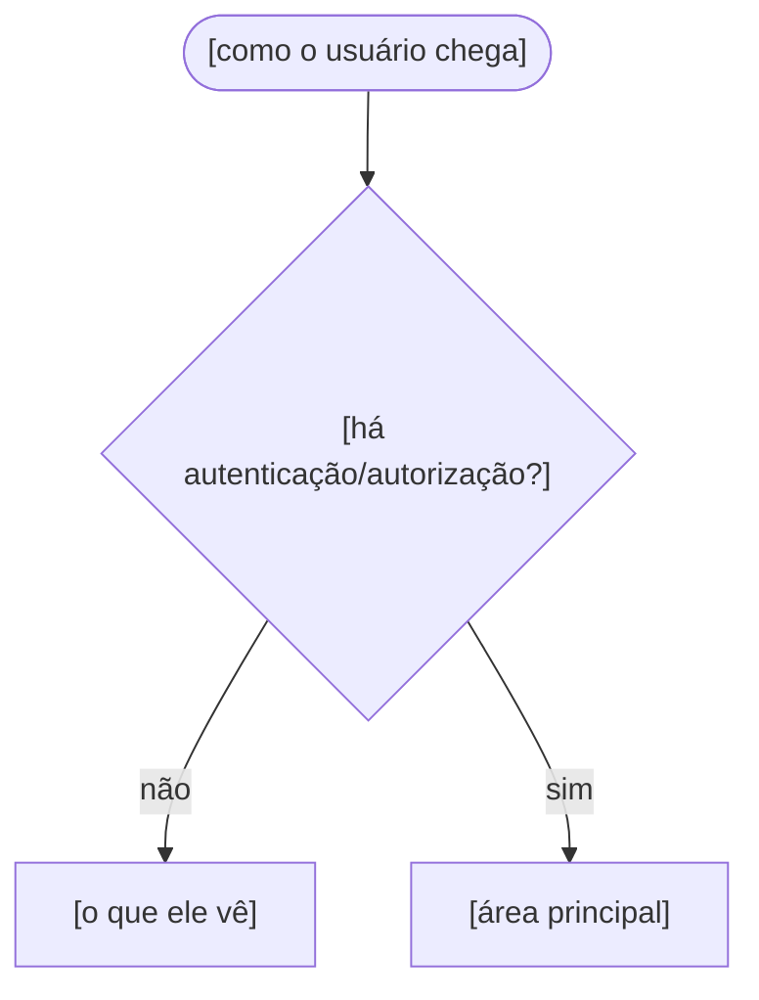
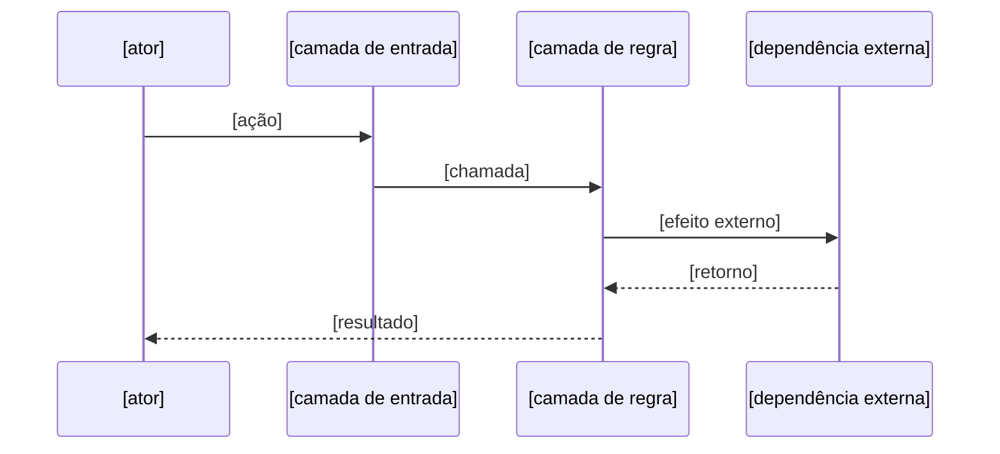

<!--
_TEMPLATE-flows.md → gera .context/arch/flows.md

Assunto EXCLUSIVO: como o usuário atravessa o sistema, e o fluxo crítico fim-a-fim.
NÃO pode conter: camadas (overview.md), módulos (modules.yaml), regras (rules.md).

Por que existe: o PLANNER precisa saber o que o usuário faz para decompor uma
feature sem esquecer um caminho. Fluxo esquecido é task esquecida.

Só documente fluxo REAL, extraído das rotas/entradas do projeto. Fluxo inventado
é pior que ausente.
-->

<!--
FALLBACK OBRIGATÓRIO — leia antes de escrever.

Projeto onde as entradas AINDA NÃO EXISTEM (greenfield, rotas não declaradas, CLI
sem comandos) é caso comum e tem tratamento definido. NÃO invente fluxo, e NÃO
deixe o arquivo genérico:

1. Declare no topo que o arquivo está incompleto e POR QUÊ (falta a fonte).
2. Preencha a tabela só com o que é verificável — inclusive "nenhuma rota ainda".
3. O fluxo crítico do domínio geralmente é conhecido pelas REGRAS mesmo sem rota:
   se rules.md fala de idempotência, append-only ou transação, o fluxo existe como
   invariante. Documente-o citando as regras por número.
4. Liste em "Pendências conhecidas" o que falta, e registre a pendência ao usuário
   no relatório final do Passo 8.
5. O arquivo se completa sozinho: cada feature que adiciona entrada declara
   `ADDED arch/flows.md: ...` no delta, e o /ship aplica.

Fluxo inventado é pior que fluxo ausente — o PLANNER planeja por cima dele.
-->

# Fluxos — [PROJECT_NAME]

> Rotas e entradas reais, extraídas de [fonte: arquivo de rotas, CLI, handlers].
> Camadas: `overview.md` · Módulos: `modules.yaml`

## Entrada e sessão

## Fluxos principais

| Fluxo | Entrada | Módulo | O que o usuário consegue |
|---|---|---|---|
| [nome] | `[rota ou comando]` | [módulo] | [resultado] |

## Fluxo crítico fim-a-fim

O fluxo onde erro custa mais caro neste projeto. Documente com sequência, porque é
o que o PLANNER consulta antes de mexer em qualquer parte dele.

**Invariantes deste fluxo** — cada um citando a regra:

- [ex: efeito externo é idempotente por <chave>] — `rules.md` #[N]
- [ex: falha parcial deixa o sistema em estado <qual>] — `rules.md` #[N]

## Entradas públicas

O que funciona sem autenticação. Lista curta e exata — é superfície de ataque.

| Entrada | Por que é pública |
|---|---|

## Pendências conhecidas

Comportamento que existe no legado ou na especificação e **ainda não** está no
código. Serve para o PLANNER não planejar por cima de algo inexistente.

- [pendência] — [motivo de não estar feito]
