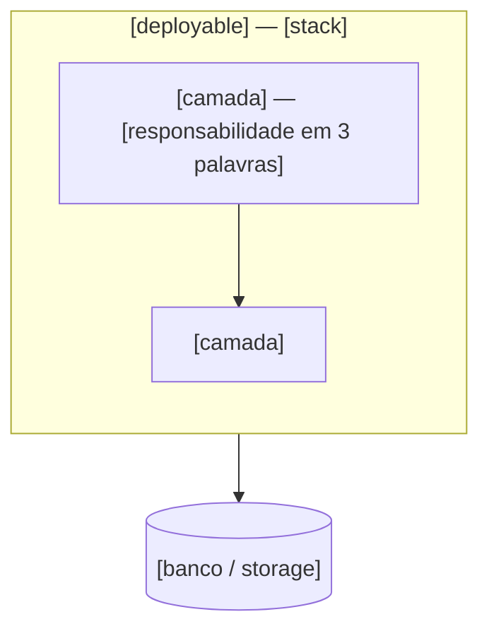
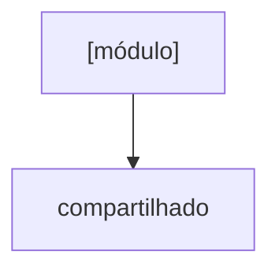

<!--
_TEMPLATE-overview.md → gera .context/arch/overview.md

Assunto EXCLUSIVO: as camadas reais e o mapa de módulos, em diagrama.
NÃO pode conter: comandos de gate (vão em gates.md), definição de módulo com
dependências (vai em modules.yaml), regras (vão em rules.md).

Este arquivo substitui o architecture.md + modules.md do V7 — o diagrama de módulos
vem para cá porque diagrama derivado de YAML não deve ser um terceiro arquivo.
-->

# Arquitetura — [PROJECT_NAME]

> [Uma linha: o que o sistema é e quantos deployables tem.]
> Módulos e dependências: `modules.yaml` · Regras: `rules.md` · Gates: `gates.md`

## Camadas

## Invariantes de fluxo

O que é sempre verdade sobre como uma requisição atravessa o sistema. Cada linha
aponta onde é reforçado — não repita a regra inteira, cite o número em `rules.md`.

| Invariante | Regra |
|---|---|
| [ex: nenhuma camada acima do repositório monta query] | `rules.md` #3 |

## Módulos

**Regras de leitura do mapa**

- O compartilhado é folha: nada nele importa módulo de domínio, sob pena de ciclo.
- Módulos irmãos não se importam fora das setas acima.
- [regra específica do projeto]

## Onde está o quê

| Camada | Path |
|---|---|
| [camada] | `[path real]` |

Mantenha esta tabela curta — ela existe para o agent achar o arquivo, não para
documentar a árvore inteira.
