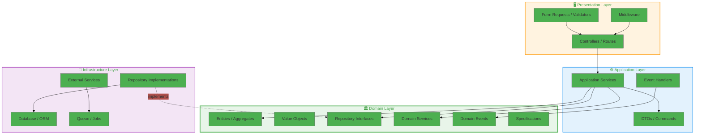
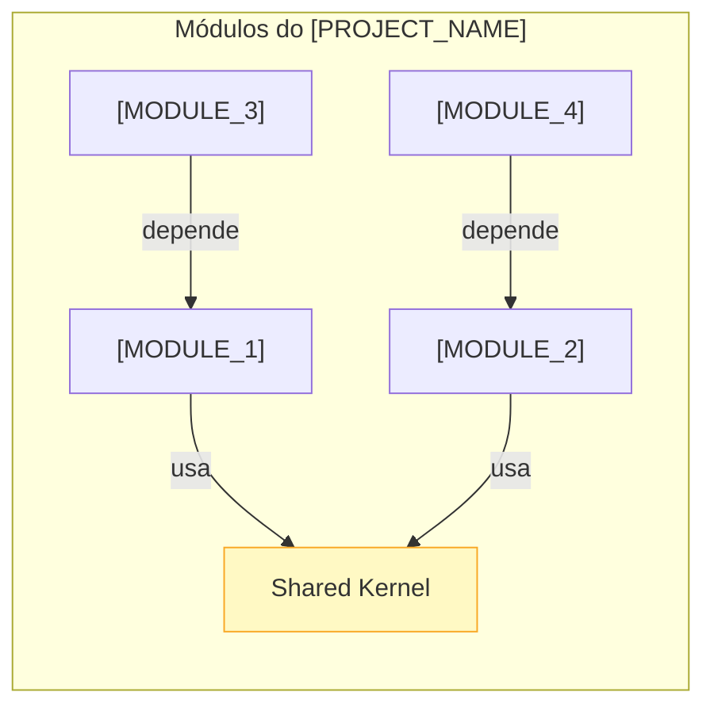
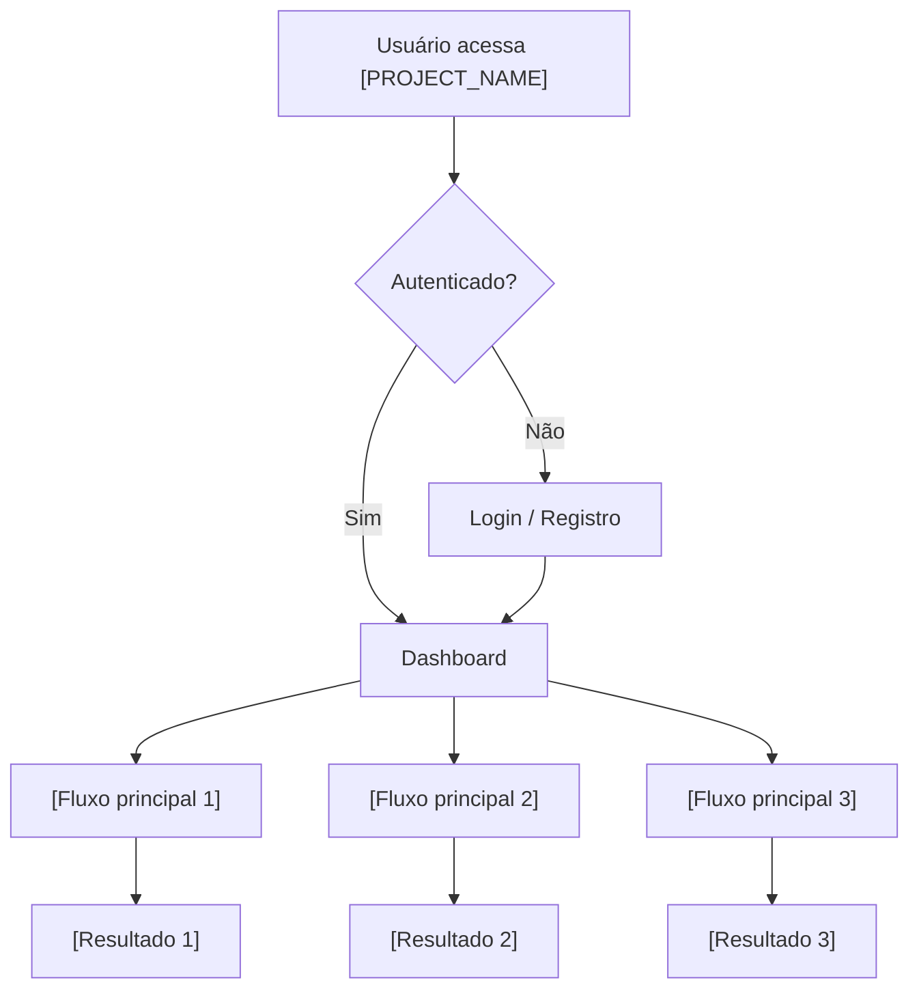

# Instrução: Setup Completo — Estrutura AI-First com Workflow PREVC

## SUA MISSÃO
Configurar a estrutura completa de desenvolvimento AI-First neste projeto.
Agents devem ser GERADOS com base no contexto real do projeto — nunca genéricos.
Siga TODOS os passos na ordem. Não pule nenhum.

---

## PASSO 0 — DETECÇÃO DO PROJETO (Obrigatório antes de tudo)

### 0.1 — Identificar cenário

```bash
echo "=== DETECÇÃO DO PROJETO ==="

# Cenário A: Projeto novo com spec?
echo "--- Buscando spec.md ---"
find . -maxdepth 3 -name "spec.md" -o -name "SPEC.md" -o -name "spec.yaml" 2>/dev/null

# Cenário B/C: Projeto com código?
echo "--- Buscando manifesto de dependências ---"
ls package.json composer.json pyproject.toml Cargo.toml go.mod pom.xml build.gradle *.csproj 2>/dev/null

# Cenário C: Já tem estrutura .claude/.context?
echo "--- Buscando estrutura existente ---"
ls -la .claude/ .context/ 2>/dev/null
```

### 0.2 — Extrair contexto do projeto

**Se encontrou `spec.md` (Cenário A — Projeto Novo):**
```bash
echo "--- Lendo spec.md ---"
cat spec.md
```
Leia o spec.md COMPLETAMENTE. Extraia e registre:
- `PROJECT_NAME`: Nome do projeto
- `PROJECT_DESCRIPTION`: Descrição
- `BACKEND_LANG`: Linguagem backend (ex: PHP 8.3)
- `BACKEND_FRAMEWORK`: Framework backend (ex: Laravel 12)
- `FRONTEND_LANG`: Linguagem frontend (ex: TypeScript 5.x)
- `FRONTEND_FRAMEWORK`: Framework frontend (ex: Angular 18)
- `DATABASE`: Banco de dados (ex: PostgreSQL 16)
- `ARCHITECTURE`: Padrão arquitetural (ex: DDD, Clean Architecture, Hexagonal)
- `ARCHITECTURE_LAYERS`: Camadas definidas (ex: Domain → Application → Infrastructure → Presentation)
- `ARCHITECTURE_RULES`: Regras invioláveis de arquitetura
- `MODULES`: Lista de módulos/bounded contexts
- `CONVENTIONS`: Convenções de código
- `BUSINESS_RULES`: Regras de negócio específicas (ex: multi-tenant, SaaS)
- `TESTING_STACK`: Ferramentas de teste (ex: PHPUnit, Jasmine)
- `INFRA`: Docker, CI/CD, deploy

**Se encontrou código mas NÃO spec.md (Cenário B — Projeto Existente):**
```bash
echo "--- Analisando código existente ---"

# Dependências e versões
cat package.json 2>/dev/null
cat composer.json 2>/dev/null
cat pyproject.toml 2>/dev/null

# Frameworks
grep -r "laravel\|symfony\|django\|fastapi\|express\|nestjs\|spring" composer.json package.json pyproject.toml 2>/dev/null
grep -r "angular\|react\|vue\|next\|nuxt\|svelte" package.json 2>/dev/null

# Banco de dados
cat .env.example 2>/dev/null | grep -i "db_\|database\|postgres\|mysql\|mongo"
cat docker-compose* 2>/dev/null | grep -i "postgres\|mysql\|mongo\|redis"

# Estrutura de pastas (inferir arquitetura)
tree src/ -L 3 -d 2>/dev/null || tree app/ -L 3 -d 2>/dev/null
tree frontend/ -L 2 -d 2>/dev/null

# Padrões de arquitetura
find . -type d -name "Domain" -o -name "Application" -o -name "Infrastructure" -o -name "Presentation" 2>/dev/null
find . -type d -name "entities" -o -name "repositories" -o -name "services" -o -name "controllers" 2>/dev/null
find . -type d -name "modules" -o -name "bounded-contexts" 2>/dev/null

# Testes
find . -name "*.spec.*" -o -name "*.test.*" -o -name "*Test.php" -o -name "test_*" 2>/dev/null | head -10
cat phpunit.xml 2>/dev/null | head -5
grep -r "jest\|vitest\|mocha\|jasmine\|karma\|cypress\|playwright" package.json 2>/dev/null

# Linters e formatadores
ls .eslintrc* .prettierrc* phpstan.neon pint.json .php-cs-fixer* tsconfig.json angular.json biome.json 2>/dev/null

# CI/CD
ls .github/workflows/*.yml .gitlab-ci.yml Jenkinsfile Dockerfile 2>/dev/null

# Convenções de nomenclatura
find src/ app/ -name "*.ts" -o -name "*.php" -o -name "*.py" 2>/dev/null | head -20
```

Analise TUDO e infira as mesmas variáveis do Cenário A.

**Se já tem `.claude/` e `.context/` (Cenário C):**
- NÃO sobrescreva agents existentes com conteúdo especializado
- NÃO sobrescreva configs existentes
- APENAS adicione o que falta
- Renomeie PLANS → FEATURES se PLANS existir
- Preserve todo conteúdo existente

### 0.3 — Registrar contexto detectado

Registre TODAS as variáveis extraídas. Exemplo:

```
CONTEXTO DETECTADO:
- Cenário: [A/B/C]
- PROJECT_NAME: PrecificaAI
- BACKEND: PHP 8.3 + Laravel 12
- FRONTEND: TypeScript 5.x + Angular 18
- DATABASE: PostgreSQL 16
- ARCHITECTURE: DDD (Domain → Application → Infrastructure → Presentation)
- ARCHITECTURE_RULES: Domain Layer não importa Laravel
- MODULES: Pricing, Products, Tenants, Users, Reports
- TESTING: PHPUnit (backend), Jasmine + Karma (frontend)
- CONVENTIONS: PSR-12 (PHP), Angular Style Guide (TS)
- BUSINESS: Multi-tenant SaaS, row-level isolation
```

**Você vai usar estas variáveis em TODOS os passos seguintes. Nunca use placeholders genéricos quando tiver dados reais.**

---

## PASSO 1 — Garantir Estrutura de Pastas

```bash
# Estrutura .claude/
mkdir -p .claude/agents
mkdir -p .claude/commands
mkdir -p .claude/hooks
mkdir -p .claude/skills

# Estrutura .context/
mkdir -p .context/ARCHITECTURE
mkdir -p .context/DOCS/FEATURES
mkdir -p .context/DOCS/TASKS
mkdir -p .context/DOCS/PRDS
mkdir -p .context/DOCS/CHANGELOG
mkdir -p .context/DOCS/MEMORY
mkdir -p .context/LAYOUT
mkdir -p .context/WORKFLOW

# Scripts
mkdir -p scripts

# Renomear PLANS se existir
if [ -d ".context/DOCS/PLANS" ]; then
  cp -rn .context/DOCS/PLANS/* .context/DOCS/FEATURES/ 2>/dev/null || true
  mv .context/DOCS/PLANS ".context/DOCS/PLANS_BACKUP_$(date +%Y%m%d)"
  echo "🔄 PLANS → FEATURES (backup criado)"
fi
```

---

## PASSO 2 — Criar settings.json e Hooks

### 2.1 — `.claude/settings.json`

```json
{
  "$schema": "https://json.schemastore.org/claude-code-settings.json",
  "permissions": {
    "allow": [
      "Read(.claude/commands/**)",
      "Read(.claude/agents/**)",
      "Read(.claude/skills/**)",
      "Read(.claude/hooks/**)",
      "Read(.context/**)",
      "Read(AGENTS.md)",
      "Read(CLAUDE.md)",
      "Bash(node .claude/hooks/router.js)"
    ],
    "deny": [
      "Bash(rm -rf *)",
      "Bash(git push *)",
      "Bash(git checkout main)",
      "Bash(npm publish)",
      "Bash(composer global *)"
    ]
  },
  "hooks": {
    "UserPromptSubmit": [
      {
        "hooks": [
          {
            "type": "command",
            "command": "node .claude/hooks/router.js",
            "timeout": 30,
            "statusMessage": "🧭 Avaliando tarefa e roteando para agent..."
          }
        ]
      }
    ]
  }
}
```

### 2.2 — `.claude/hooks/router.js`

Crie o arquivo `.claude/hooks/router.js`:

```javascript
#!/usr/bin/env node
/**
 * Router Hook — [PROJECT_NAME]
 * 
 * Lê a mensagem do usuário via stdin, identifica a skill/agent adequado,
 * e injeta contexto adicional para o Claude Code.
 * 
 * Integrado ao workflow PREVC.
 */

const fs = require('fs');
const path = require('path');

const PROJECT_ROOT = path.join(__dirname, '..', '..');

function readStdin() {
  return new Promise((resolve, reject) => {
    let data = '';
    process.stdin.on('readable', () => {
      let chunk;
      while ((chunk = process.stdin.read()) !== null) {
        data += chunk;
      }
    });
    process.stdin.on('end', () => resolve(data));
    process.stdin.on('error', reject);
  });
}

function readFile(filePath) {
  try {
    return fs.readFileSync(filePath, 'utf8');
  } catch {
    return null;
  }
}

function extractUserMessage(stdinData) {
  try {
    const parsed = JSON.parse(stdinData);
    const msg = parsed.arguments || parsed.text || parsed.userMessage || parsed.content || parsed.message;
    if (msg) return msg;

    if (parsed.session_id && stdinData.includes('"text"')) {
      const match = stdinData.match(/"text"\s*:\s*"([^"]+)"/);
      if (match) return match[1];
    }

    return stdinData;
  } catch {
    return stdinData;
  }
}

function findMatchingSkill(userMessage) {
  const message = userMessage.toLowerCase();

  // PREVC workflow commands primeiro
  const skillMap = [
    // PREVC Workflow
    { keywords: ['nova feature', 'criar feature', 'new feature', 'planejar feature'], skill: 'new-feature', agent: 'PM' },
    { keywords: ['revisar feature', 'review feature', 'aprovar feature'], skill: 'review-feature', agent: 'REVIEWER' },
    { keywords: ['decompor', 'decompose', 'quebrar em tasks', 'criar tasks'], skill: 'decompose', agent: 'ARCHITECT' },
    { keywords: ['validar tasks', 'validate tasks', 'checar tasks'], skill: 'validate-tasks', agent: 'QA' },
    { keywords: ['implementar task', 'implement task', 'executar task'], skill: 'implement-task', agent: 'DEV' },
    { keywords: ['validar implementação', 'validate', 'rodar gates', 'gates'], skill: 'validate', agent: 'QA' },
    { keywords: ['confirmar task', 'confirm task', 'fechar task'], skill: 'confirm-task', agent: 'DOC' },
    { keywords: ['status feature', 'feature status', 'progresso'], skill: 'feature-status', agent: 'PM' },

    // Especialidades
    { keywords: ['prd', 'product requirements', 'requisitos de produto'], skill: 'generate-prd', agent: 'PM' },
    { keywords: ['arquitetura', 'architecture', 'diagrama', 'módulos'], skill: null, agent: 'ARCHITECT' },
    { keywords: ['migration', 'schema', 'banco de dados', 'database', 'tabela'], skill: null, agent: 'DBA' },
    { keywords: ['bug', 'erro', 'fix', 'debug', 'quebrou', 'falhando'], skill: null, agent: 'DEBUG' },
    { keywords: ['teste', 'test', 'tdd', 'cobertura', 'coverage'], skill: null, agent: 'QA' },
    { keywords: ['commit', 'git', 'mensagem de commit'], skill: null, agent: 'GIT_COMMIT' },
    { keywords: ['documentar', 'docs', 'documentação', 'changelog'], skill: null, agent: 'DOC' },
    { keywords: ['review', 'revisar', 'code review'], skill: null, agent: 'REVIEWER' },
    { keywords: ['frontend', 'componente', 'ui', 'interface', 'página', 'tela'], skill: null, agent: 'FRONTEND' },
    { keywords: ['backend', 'api', 'endpoint', 'service', 'controller'], skill: null, agent: 'BACKEND' },
    { keywords: ['layout', 'design', 'mockup', 'wireframe', 'ux'], skill: null, agent: 'DESIGNER' },
  ];

  for (const item of skillMap) {
    if (item.keywords.some(kw => message.includes(kw))) {
      return item;
    }
  }

  return null;
}

function determineComplexity(userMessage) {
  const message = userMessage.toLowerCase();

  const complexIndicators = [
    'módulo', 'múltiplas', 'multi', 'backend e frontend', 'end-to-end',
    'cross', 'refatorar', 'migrar', 'dashboard', 'relatório', 'integração',
    'feature completa', 'sistema', 'fluxo completo'
  ];
  const simpleIndicators = [
    'bug', 'fix', 'corrigir', 'erro', 'ajuste', 'pequeno', 'simples',
    'typo', 'rename', 'mover', 'deletar'
  ];

  let complexScore = complexIndicators.filter(i => message.includes(i)).length;
  let simpleScore = simpleIndicators.filter(i => message.includes(i)).length;

  return complexScore > simpleScore ? 'complex' : 'simple';
}

function loadAgentSummary() {
  const agentsDir = path.join(PROJECT_ROOT, '.claude', 'agents');
  let summary = '\n### Agents Disponíveis\n';
  summary += '| Agent | Fase PREVC | Trigger |\n';
  summary += '|-------|-----------|--------|\n';

  const agentPhases = {
    'PM': 'Planning, Confirm',
    'ARCHITECT': 'Planning, Review',
    'REVIEWER': 'Review',
    'BACKEND': 'Execution',
    'FRONTEND': 'Execution',
    'DEV': 'Execution',
    'DBA': 'Execution',
    'QA': 'Validation',
    'DEBUG': 'Execution (bugs)',
    'DOC': 'Confirm',
    'GIT_COMMIT': 'Confirm',
    'ORCHESTRATOR': 'Todas',
    'DESIGNER': 'Planning'
  };

  try {
    const files = fs.readdirSync(agentsDir);
    for (const file of files) {
      if (file.endsWith('.md')) {
        const name = file.replace('.md', '');
        const phase = agentPhases[name] || 'N/A';
        summary += `| @${name} | ${phase} | Ver .claude/agents/${file} |\n`;
      }
    }
  } catch {
    summary += '| (nenhum agent encontrado) | | |\n';
  }

  return summary;
}

function checkPREVCState() {
  const featuresDir = path.join(PROJECT_ROOT, '.context', 'DOCS', 'FEATURES');
  const tasksDir = path.join(PROJECT_ROOT, '.context', 'DOCS', 'TASKS');

  let state = '\n### Estado PREVC Atual\n';

  try {
    const features = fs.readdirSync(featuresDir).filter(f => f.endsWith('.md') && !f.startsWith('_') && f !== 'README.md');
    const tasks = fs.readdirSync(tasksDir).filter(f => f.endsWith('.md') && !f.startsWith('_') && f !== 'README.md');

    state += `- Features documentadas: ${features.length}\n`;
    state += `- Arquivos de tasks: ${tasks.length}\n`;

    if (features.length > 0) {
      state += `- Última feature: ${features[features.length - 1]}\n`;
    }
  } catch {
    state += '- Nenhuma feature/task encontrada ainda\n';
  }

  return state;
}

async function main() {
  try {
    const stdinData = await readStdin();
    const userMessage = extractUserMessage(stdinData);

    if (!userMessage || userMessage.trim().length === 0) {
      process.stdout.write(JSON.stringify({ continue: true }));
      return;
    }

    const match = findMatchingSkill(userMessage);
    const complexity = determineComplexity(userMessage);

    let additionalContext = '';

    if (match && match.skill) {
      additionalContext = `
## 🧭 Roteamento Automático

**Comando sugerido:** /${match.skill}
**Agent primário:** @${match.agent}
**Complexidade:** ${complexity}

> Workflow PREVC: consulte \`.context/WORKFLOW/PREVC.md\`
> Sempre registre decisões em \`.context/DOCS/MEMORY/\`
> Ao concluir tasks, atualize \`.context/DOCS/CHANGELOG/\`
`;
    } else if (match && match.agent) {
      additionalContext = `
## 🧭 Roteamento Automático

**Agent recomendado:** @${match.agent}
**Complexidade:** ${complexity}
**Consultar:** \`.claude/agents/${match.agent}.md\`

> Workflow PREVC: consulte \`.context/WORKFLOW/PREVC.md\`
> Sempre registre decisões em \`.context/DOCS/MEMORY/\`
`;
    } else if (complexity === 'complex') {
      additionalContext = `
## 🧭 Roteamento Automático

**Nenhuma skill/agent específico identificado**
**Complexidade:** ALTA — recomendado @ORCHESTRATOR
**Consultar:** \`.claude/agents/ORCHESTRATOR.md\`

> Para tarefas complexas, siga o PREVC: \`.context/WORKFLOW/PREVC.md\`
`;
    } else {
      additionalContext = `
## 🧭 Roteamento Automático

**Complexidade:** Simples
**Recomendação:** Resposta direta ou @DEV
`;
    }

    // Carregar contexto adicional
    const agentSummary = loadAgentSummary();
    const prevcState = checkPREVCState();

    const output = {
      continue: true,
      hookSpecificOutput: {
        hookEventName: 'UserPromptSubmit',
        additionalContext: (additionalContext + agentSummary + prevcState).trim()
      }
    };

    process.stdout.write(JSON.stringify(output));

  } catch (error) {
    process.stdout.write(JSON.stringify({ continue: true }));
  }
}

main();
```

---

## PASSO 3 — Criar Arquivos de ARCHITECTURE

Gere os arquivos de arquitetura com base no contexto detectado no Passo 0.
**Substitua TODAS as variáveis por dados REAIS do projeto.**

### 3.1 — `.context/ARCHITECTURE/architecture.mmd`



**IMPORTANTE:** Adapte este diagrama para a arquitetura REAL detectada. Se não é DDD, gere o diagrama correto (MVC, Clean Architecture, Hexagonal, etc.).

### 3.2 — `.context/ARCHITECTURE/modules.yaml`

```yaml
# Módulos do [PROJECT_NAME]
# Gerado com base em: [spec.md | análise do código]

version: "1.0"
project: "[PROJECT_NAME]"
architecture: "[ARCHITECTURE]"
generated_at: "[YYYY-MM-DD]"

modules:
  # [GERAR UM BLOCO PARA CADA MÓDULO DETECTADO]
  # Exemplo para DDD com módulos:

  - name: "[MODULE_1]"
    description: "[Descrição do módulo]"
    type: "bounded-context"
    status: "active"
    path: "[caminho/real/do/modulo]"
    dependencies:
      - "[MODULE_2]"
    exposes:
      - "[Serviço ou interface exposta]"
    database_tables:
      - "[tabela_1]"
      - "[tabela_2]"

  - name: "[MODULE_2]"
    description: "[Descrição]"
    type: "bounded-context"
    status: "active"
    path: "[caminho/real]"
    dependencies: []
    exposes:
      - "[Serviço exposto]"
    database_tables:
      - "[tabela]"

  # Repetir para CADA módulo detectado
```

### 3.3 — `.context/ARCHITECTURE/modules.mmd`



**Adapte as conexões para as dependências REAIS entre módulos.**

### 3.4 — `.context/ARCHITECTURE/dependencies.yaml`

```yaml
# Dependências entre módulos
# Regra: dependências devem ser unidirecionais. Ciclos são proibidos.

version: "1.0"
project: "[PROJECT_NAME]"

dependency_rules:
  - "Domain Layer NÃO depende de nenhuma outra camada"
  - "Application Layer depende apenas de Domain"
  - "Infrastructure Layer depende de Domain (implementa interfaces)"
  - "Presentation Layer depende de Application"
  - "[OUTRAS REGRAS DETECTADAS]"

module_dependencies:
  "[MODULE_1]":
    depends_on: ["[MODULE_2]"]
    communication: "[sync/async/events]"
    
  "[MODULE_2]":
    depends_on: []
    communication: "standalone"

  # Repetir para cada módulo

forbidden_dependencies:
  - from: "Domain"
    to: "Infrastructure"
    reason: "Viola DDD — Domain não conhece implementação"
  - from: "[MODULE_X]"
    to: "[MODULE_Y]"
    reason: "[motivo]"
```

### 3.5 — `.context/ARCHITECTURE/project-state.yaml`

```yaml
# Estado atual do projeto
# Atualizado a cada fase CONFIRM do PREVC

version: "1.0"
project: "[PROJECT_NAME]"
last_updated: "[YYYY-MM-DD]"

stack:
  backend:
    language: "[BACKEND_LANG]"
    framework: "[BACKEND_FRAMEWORK]"
    version: "[versão]"
  frontend:
    language: "[FRONTEND_LANG]"
    framework: "[FRONTEND_FRAMEWORK]"
    version: "[versão]"
  database:
    type: "[DATABASE]"
    version: "[versão]"
  testing:
    backend: "[TESTING backend]"
    frontend: "[TESTING frontend]"
    e2e: "[se houver]"

metrics:
  total_features: 0
  features_completed: 0
  features_in_progress: 0
  total_tasks: 0
  tasks_completed: 0
  tasks_in_progress: 0
  tasks_pending: 0

modules_status:
  # [GERAR para cada módulo]
  "[MODULE_1]":
    status: "[planned | in_progress | active | deprecated]"
    completion: "[0-100]%"
    last_change: "[YYYY-MM-DD]"

quality:
  test_coverage_backend: "[X]%"
  test_coverage_frontend: "[X]%"
  lint_status: "[clean | warnings | errors]"
  last_validation: "[YYYY-MM-DD]"
```

### 3.6 — `.context/ARCHITECTURE/project-brain.yaml`

```yaml
# Cérebro do Projeto — Metadados para IA
# Este arquivo ajuda a IA a entender o projeto rapidamente

version: "1.0"
project: "[PROJECT_NAME]"
last_updated: "[YYYY-MM-DD]"

identity:
  name: "[PROJECT_NAME]"
  description: "[DESCRIPTION]"
  type: "[SaaS | API | Monólito | Microserviços | etc.]"
  domain: "[Domínio de negócio — ex: precificação, e-commerce, fintech]"

architecture:
  pattern: "[ARCHITECTURE]"
  layers: 
    - "[LAYER_1]"
    - "[LAYER_2]"
    - "[LAYER_3]"
    - "[LAYER_4]"
  core_principles:
    - "[Princípio 1 — ex: SOLID]"
    - "[Princípio 2 — ex: DDD]"
    - "[Princípio 3]"

key_decisions:
  - decision: "[Decisão importante]"
    rationale: "[Por quê]"
    date: "[YYYY-MM-DD]"
    alternatives_rejected: "[O que foi descartado]"

business_rules:
  - "[Regra de negócio 1 — ex: Multi-tenant com isolamento por row]"
  - "[Regra de negócio 2]"
  - "[Regra de negócio 3]"

conventions:
  file_naming: "[kebab-case | PascalCase | snake_case]"
  class_naming: "[PascalCase]"
  function_naming: "[camelCase | snake_case]"
  constant_naming: "[UPPER_SNAKE_CASE]"
  commit_format: "Conventional Commits (pt-BR)"
  branch_format: "[feature/FEAT-NNN-descricao | etc.]"

sensitive_areas:
  - path: "[caminho/crítico]"
    reason: "[Por que é sensível — ex: billing, auth, tenant isolation]"
    extra_care: "[Cuidado extra necessário]"
```

### 3.7 — `.context/ARCHITECTURE/context-version.yaml`

```yaml
# Versionamento do contexto
# Controla quando cada arquivo de contexto foi atualizado

version: "1.0"
project: "[PROJECT_NAME]"

context_files:
  "AGENTS.md":
    version: "1.0.0"
    last_updated: "[YYYY-MM-DD]"
    updated_by: "setup-ai"
    
  ".context/ARCHITECTURE/architecture.mmd":
    version: "1.0.0"
    last_updated: "[YYYY-MM-DD]"
    updated_by: "setup-ai"

  ".context/ARCHITECTURE/modules.yaml":
    version: "1.0.0"
    last_updated: "[YYYY-MM-DD]"
    updated_by: "setup-ai"

  ".context/ARCHITECTURE/project-state.yaml":
    version: "1.0.0"
    last_updated: "[YYYY-MM-DD]"
    updated_by: "setup-ai"

  ".context/ARCHITECTURE/project-brain.yaml":
    version: "1.0.0"
    last_updated: "[YYYY-MM-DD]"
    updated_by: "setup-ai"

  ".context/WORKFLOW/PREVC.md":
    version: "1.0.0"
    last_updated: "[YYYY-MM-DD]"
    updated_by: "setup-ai"

  ".context/WORKFLOW/validation-flow.md":
    version: "1.0.0"
    last_updated: "[YYYY-MM-DD]"
    updated_by: "setup-ai"
```

### 3.8 — `.context/ARCHITECTURE/user-flow.mmd`



**Adapte para os fluxos REAIS do projeto.**

---

## PASSO 4 — Criar Templates de CHANGELOG e MEMORY

### 4.1 — `.context/DOCS/CHANGELOG/_TEMPLATE.md`

```markdown
# Changelog — [YYYY-MM-DD]

> Registro factual do que mudou. Para decisões e contexto, veja MEMORY.

## Formato

Cada entrada segue:
```text
- [HORA] [TIPO] [ESCOPO]: Descrição concisa
  - Detalhes relevantes
  - Arquivos principais afetados
  - Task/Feature relacionada
```

## Tipos
- `FEAT` — Nova funcionalidade
- `FIX` — Correção de bug
- `REFACTOR` — Refatoração sem mudança de comportamento
- `DOCS` — Documentação
- `TEST` — Testes
- `CHORE` — Configuração, tooling, infra
- `BREAKING` — Mudança que quebra compatibilidade

---

## Entradas

<!-- Preencher durante o dia, a cada CONFIRM do PREVC -->

- [HH:MM] FEAT [módulo]: Descrição
  - Detalhes
  - Arquivos: `path/to/file.ext`
  - Ref: FEAT-NNN / TASK-NNN
```

### 4.2 — `.context/DOCS/CHANGELOG/README.md`

```markdown
# 📜 Changelog

Registro cronológico de TODAS as mudanças no projeto.
Atualizado na fase **CONFIRM** do PREVC.

## Convenções
- Um arquivo por dia: `YYYY-MM-DD.md`
- Template: `_TEMPLATE.md`
- Registro factual — O QUE mudou, não POR QUÊ (por quê vai no MEMORY)
- Toda task concluída DEVE gerar entrada no changelog
- Toda feature concluída gera entrada de resumo

## Como usar
- Na fase CONFIRM: adicionar entrada para a task concluída
- Ao finalizar feature: adicionar resumo com todas as tasks
- Para release: consolidar entradas relevantes

## Consultar
- Último changelog: ordenar por data, pegar o mais recente
- Histórico de um módulo: `grep -r "[módulo]" .context/DOCS/CHANGELOG/`
```

### 4.3 — Criar changelog inicial

Crie `.context/DOCS/CHANGELOG/[DATA-DE-HOJE].md`:

```markdown
# Changelog — [YYYY-MM-DD]

## Entradas

- [HH:MM] CHORE [project]: Setup da estrutura AI-First com workflow PREVC
  - Criado AGENTS.md como fonte da verdade
  - Configurado hooks e router para roteamento automático
  - Criados agents especializados para a stack [STACK DETECTADA]
  - Configurado workflow PREVC com validation gates
  - Criados templates para FEATURES, TASKS, CHANGELOG e MEMORY
  - Documentada arquitetura em `.context/ARCHITECTURE/`
  - Ref: Setup inicial
```

### 4.4 — `.context/DOCS/MEMORY/_TEMPLATE.md`

```markdown
# Memory: [Título Descritivo da Decisão/Aprendizado]

## Metadados
| Campo | Valor |
|-------|-------|
| **Tipo** | 🧠 Decisão / 📚 Aprendizado / ⚠️ Armadilha / 💡 Insight |
| **Data** | [YYYY-MM-DD] |
| **Autor** | [Nome ou Agent] |
| **Contexto** | [Feature/Task/Situação que gerou] |
| **Tags** | [tag1, tag2, tag3] |

---

## Situação
> O que estava acontecendo? Qual o contexto?

[Descrição da situação]

---

## Decisão / Aprendizado
> O que foi decidido ou aprendido?

[Descrição clara]

---

## Alternativas Consideradas
> O que foi descartado e por quê?

| Alternativa | Por que descartada |
|------------|-------------------|
| [Opção A] | [Motivo] |
| [Opção B] | [Motivo] |

---

## Consequências
> O que muda por causa disso?

### Positivas
- [Consequência positiva 1]

### Negativas / Trade-offs
- [Trade-off 1]

---

## Referências
- [Links, docs, discussions]
- Feature: `.context/DOCS/FEATURES/[feature].md`
- Task: `.context/DOCS/TASKS/[task].md`
```

### 4.5 — `.context/DOCS/MEMORY/README.md`

```markdown
# 🧠 Memory

Memória persistente do projeto. Decisões, aprendizados e armadilhas.
Consultado pela IA para NÃO repetir erros e manter consistência.

## Tipos de Registro

| Tipo | Emoji | Quando Registrar |
|------|-------|-----------------|
| Decisão | 🧠 | Quando uma decisão técnica ou de produto é tomada |
| Aprendizado | 📚 | Quando algo é descoberto que outros devem saber |
| Armadilha | ⚠️ | Quando algo deu errado e não deve se repetir |
| Insight | 💡 | Quando uma observação pode melhorar o projeto |

## Convenções
- Um arquivo por decisão/aprendizado: `[YYYY-MM-DD]-[titulo-kebab].md`
- Template: `_TEMPLATE.md`
- Tags para facilitar busca
- Sempre referenciar feature/task que gerou

## Quando Registrar
- Fase CONFIRM do PREVC → decisões tomadas durante a feature
- Após resolver um bug difícil → armadilha para não repetir
- Após discussão técnica → decisão com alternativas descartadas
- Quando descobrir algo não óbvio do código → aprendizado

## Como Consultar (IA)
- Antes de implementar: `grep -r "[termo]" .context/DOCS/MEMORY/`
- Antes de decidir: buscar decisões anteriores sobre o mesmo tema
- Antes de refatorar: verificar armadilhas conhecidas
```

### 4.6 — Criar memory inicial

Crie `.context/DOCS/MEMORY/[DATA-DE-HOJE]-setup-ai-first.md`:

```markdown
# Memory: Setup da Estrutura AI-First com PREVC

## Metadados
| Campo | Valor |
|-------|-------|
| **Tipo** | 🧠 Decisão |
| **Data** | [YYYY-MM-DD] |
| **Autor** | Setup automático |
| **Contexto** | Configuração inicial do projeto para desenvolvimento com IA |
| **Tags** | setup, estrutura, prevc, ai-first |

---

## Situação
Projeto precisava de uma estrutura que permitisse desenvolvimento eficiente com IA,
com contexto adequado, workflow definido e qualidade garantida.

---

## Decisão
Adotar estrutura AI-First com:
- **AGENTS.md** como fonte da verdade (symlink via CLAUDE.md)
- **PREVC** como workflow obrigatório (Planning → Review → Execution → Validation → Confirm)
- **T.A.C.E** como framework de decomposição de tarefas
- **Agents especializados** gerados para a stack: [STACK DETECTADA]
- **Hooks** com router.js para roteamento automático de tarefas
- **CHANGELOG** diário para registro factual
- **MEMORY** para decisões e aprendizados persistentes

---

## Consequências

### Positivas
- IA sempre tem contexto adequado via AGENTS.md
- Tasks nunca são vagas (T.A.C.E garante especificidade)
- Qualidade garantida via gates inegociáveis
- Conhecimento não se perde (MEMORY)
- Histórico rastreável (CHANGELOG)

### Trade-offs
- Setup inicial requer investimento de tempo
- Disciplina necessária para manter docs atualizados
- Overhead de processo para mudanças muito pequenas
```

---

## PASSO 5 — Gerar Agents Especializados

### REGRA FUNDAMENTAL
> Agents NÃO são genéricos. Cada agent é ESPECIALISTA no contexto 
> REAL deste projeto — stack, arquitetura, convenções, regras de negócio.
> Use as variáveis extraídas no Passo 0 para preencher TUDO.

### Formato obrigatório

Todo agent em `.claude/agents/` DEVE seguir esta estrutura:

```markdown
---
name: "[NOME]"
description: "[Descrição com referência à stack REAL]"
capabilities:
  - "[Capacidade específica para ESTE projeto]"
triggers:
  - "[Quando ativar — específico ao PREVC]"
---

# [EMOJI] [NOME] — [Título]

## Mission
[Missão específica para ESTE projeto, referenciando stack e regras reais]

## Inviolable Rules
[Regras que NUNCA pode quebrar — extraídas da spec/código]

## Workflow
> Segue PREVC — ver `.context/WORKFLOW/PREVC.md`
[Em qual fase do PREVC este agent atua]

## Integration
| Item       | Path                                   |
| ---------- | -------------------------------------- |
| Contract   | `AGENTS.md`                            |
| Workflow   | `.context/WORKFLOW/PREVC.md`           |
| Validation | `.context/WORKFLOW/validation-flow.md` |
| Memory     | `.context/DOCS/MEMORY/`               |
| Changelog  | `.context/DOCS/CHANGELOG/`            |

## Constraints
[O que NÃO faz — delegações explícitas]
```

### Gerar TODOS os agents

Crie cada agent com dados REAIS do Passo 0:

#### `.claude/agents/ORCHESTRATOR.md`
```markdown
---
name: "ORCHESTRATOR"
description: "Coordena tarefas complexas multi-agent no [PROJECT_NAME]"
capabilities:
  - "Coordenar features que exigem [BACKEND_FRAMEWORK] + [FRONTEND_FRAMEWORK] + [DATABASE]"
  - "Decidir qual agent acionar para cada task"
  - "Gerenciar dependências entre tasks"
  - "Manter visão geral do progresso via PREVC"
triggers:
  - "Quando uma feature tem tasks em múltiplas camadas"
  - "Quando há dependência complexa entre tasks"
  - "Quando o usuário pede para implementar uma feature completa"
---

# 🎯 ORCHESTRATOR — Coordenador de Execução

## Mission

Coordenar a execução de features complexas no [PROJECT_NAME],
delegando tasks para os agents certos na ordem certa, garantindo
que o workflow PREVC seja seguido integralmente.

## Mapa de Delegação

| Tipo de Task | Agent | Fase PREVC |
|-------------|-------|-----------|
| Feature doc, escopo, prioridade | PM | Planning |
| Decisão de arquitetura | ARCHITECT | Planning / Review |
| Revisão de docs e código | REVIEWER | Review |
| API, lógica server-side | BACKEND | Execution |
| UI, componentes | FRONTEND | Execution |
| End-to-end cross-camada | DEV | Execution |
| Schema, migrations | DBA | Execution |
| Bug investigation | DEBUG | Execution |
| UI/UX consultoria | DESIGNER | Planning |
| Testes, gates | QA | Validation |
| Documentação, changelog | DOC | Confirm |
| Mensagem de commit | GIT_COMMIT | Confirm |

## Workflow PREVC — Fluxo de Orquestração

```text
1. PM cria feature doc                    (PLANNING)
2. REVIEWER + ARCHITECT validam           (REVIEW)
3. ARCHITECT decompõe em tasks T.A.C.E    (REVIEW → TASKS)
4. Para cada task:
   a. Identificar agent correto           (ORCHESTRATOR)
   b. Agent executa task                  (EXECUTION)
   c. QA valida gates + critérios         (VALIDATION)
   d. DOC registra + GIT_COMMIT comita    (CONFIRM)
5. DOC atualiza CHANGELOG                 (CONFIRM)
6. Registrar aprendizados em MEMORY       (CONFIRM)
7. PM fecha feature                       (CONFIRM)
```

## Inviolable Rules

1. NUNCA pular fases do PREVC
2. NUNCA executar sem tasks decompostas com T.A.C.E
3. Tasks com dependência DEVEM respeitar ordem
4. Gates são inegociáveis — QA reprova → volta para EXECUTION
5. TODA feature concluída gera entrada em CHANGELOG
6. TODA decisão relevante gera entrada em MEMORY

## Integration

| Item       | Path                                   |
| ---------- | -------------------------------------- |
| Contract   | `AGENTS.md`                            |
| Workflow   | `.context/WORKFLOW/PREVC.md`           |
| Validation | `.context/WORKFLOW/validation-flow.md` |
| Features   | `.context/DOCS/FEATURES/`             |
| Tasks      | `.context/DOCS/TASKS/`                |
| Memory     | `.context/DOCS/MEMORY/`               |
| Changelog  | `.context/DOCS/CHANGELOG/`            |
| Arch       | `.context/ARCHITECTURE/`              |

## Constraints

- NÃO implementa código diretamente — SEMPRE delega
- NÃO toma decisões de produto — consulta PM
- NÃO toma decisões de arquitetura — consulta ARCHITECT
```

#### `.claude/agents/ARCHITECT.md`
```markdown
---
name: "ARCHITECT"
description: "Define arquitetura, padrões e decisões técnicas do [PROJECT_NAME]"
capabilities:
  - "Definir e evoluir a arquitetura [ARCHITECTURE] do sistema"
  - "Tomar decisões técnicas e registrar em MEMORY"
  - "Revisar módulos ([MODULES]) e suas dependências"
  - "Validar conformidade com camadas: [ARCHITECTURE_LAYERS]"
  - "Manter .context/ARCHITECTURE/ atualizado"
triggers:
  - "Quando uma nova feature impacta múltiplos módulos"
  - "Quando há decisão técnica com trade-offs significativos"
  - "Quando a estrutura de pastas ou camadas precisa evoluir"
---

# 🏛️ ARCHITECT — Arquiteto de Software

## Mission

Garantir que toda decisão técnica do [PROJECT_NAME] siga os princípios
[ARCHITECTURE] definidos, mantendo a arquitetura coerente, escalável e sustentável.

Stack: [BACKEND_FRAMEWORK] + [FRONTEND_FRAMEWORK] + [DATABASE]

## Inviolable Rules

[GERAR com base no ARCHITECTURE_RULES detectado:]
1. [Regra 1 da arquitetura — ex: Domain Layer sem imports do framework]
2. [Toda decisão técnica registrada em `.context/DOCS/MEMORY/`]
3. [Módulos se comunicam via [padrão] — nunca acesso direto]
4. [Mudanças em .context/ARCHITECTURE/ requerem atualização de context-version.yaml]

## Workflow

> Atua nas fases **PLANNING** e **REVIEW** do PREVC.

1. Planning: Define abordagem técnica, valida impacto arquitetural
2. Review: Valida feature doc contra arquitetura
3. Sob demanda: Consultado em tasks que impactam múltiplos módulos
4. SEMPRE: Registra decisões em MEMORY ao final

## Architectural Artifacts

| Artefato | Path | Quando Atualizar |
|----------|------|-----------------|
| Diagrama geral | `.context/ARCHITECTURE/architecture.mmd` | Mudança de camadas |
| Módulos | `.context/ARCHITECTURE/modules.yaml` | Novo módulo/dependência |
| Mapa de módulos | `.context/ARCHITECTURE/modules.mmd` | Mudança de dependências |
| Dependências | `.context/ARCHITECTURE/dependencies.yaml` | Nova dependência |
| Estado | `.context/ARCHITECTURE/project-state.yaml` | Cada CONFIRM |
| Brain | `.context/ARCHITECTURE/project-brain.yaml` | Decisão estrutural |
| Fluxo usuário | `.context/ARCHITECTURE/user-flow.mmd` | Novo fluxo |

## Integration

| Item       | Path                                   |
| ---------- | -------------------------------------- |
| Contract   | `AGENTS.md`                            |
| Workflow   | `.context/WORKFLOW/PREVC.md`           |
| Validation | `.context/WORKFLOW/validation-flow.md` |
| Memory     | `.context/DOCS/MEMORY/`               |
| Arch       | `.context/ARCHITECTURE/`              |

## Constraints

- NÃO escreve código de implementação — delega para DEV/BACKEND/FRONTEND
- NÃO toma decisões de UI/UX — delega para DESIGNER/FRONTEND
- NÃO define regras de negócio — extrai da spec e dos PRDs
```

#### Gerar os demais agents

Seguindo o MESMO formato, gere cada agent com dados REAIS:

- **`.claude/agents/PM.md`** — Fases: Planning + Confirm. Responsável por features docs e fechamento. DEVE mencionar CHANGELOG e MEMORY nas Inviolable Rules.
- **`.claude/agents/BACKEND.md`** — Especialista em [BACKEND_LANG] + [BACKEND_FRAMEWORK]. Gates específicos. Fase: Execution.
- **`.claude/agents/FRONTEND.md`** — Especialista em [FRONTEND_LANG] + [FRONTEND_FRAMEWORK]. Fase: Execution.
- **`.claude/agents/DBA.md`** — Especialista em [DATABASE]. Fase: Execution (migrations, schema).
- **`.claude/agents/DEV.md`** — Full-stack [BACKEND_FRAMEWORK] + [FRONTEND_FRAMEWORK]. Fase: Execution (cross-camada).
- **`.claude/agents/QA.md`** — Gates de validation-flow.md. Fase: Validation. DEVE listar comandos reais.
- **`.claude/agents/REVIEWER.md`** — Review de código e feature docs. Checklists baseados na arquitetura real. Fase: Review.
- **`.claude/agents/DEBUG.md`** — Investigação de bugs. Ferramentas da stack. Fase: Execution (sob demanda).
- **`.claude/agents/DOC.md`** — Documentação, CHANGELOG, MEMORY. Fase: Confirm. DEVE detalhar formato dos registros.
- **`.claude/agents/GIT_COMMIT.md`** — Commits semânticos. Fase: Confirm.
- **`.claude/agents/DESIGNER.md`** — UI/UX. Referencia `.context/LAYOUT/`. Fase: Planning.

**REGRAS para TODOS os agents:**
1. Substituir TODAS variáveis por valores REAIS
2. Inviolable Rules extraídas do spec/código — NUNCA genéricas
3. Integration table SEMPRE inclui Memory e Changelog
4. Constraints com delegações explícitas
5. Se agent já existe com conteúdo especializado (Cenário C) — NÃO sobrescrever

---

## PASSO 6 — Criar AGENTS.md (Fonte da Verdade)

Crie `AGENTS.md` na raiz. **TODAS as variáveis substituídas por valores reais.**

```markdown
# AGENTS.md — Fonte da Verdade do Projeto

> Lido automaticamente pelo Claude Code via symlink CLAUDE.md.

---

## 🏗️ Identidade
- **Nome:** [PROJECT_NAME]
- **Descrição:** [PROJECT_DESCRIPTION]
- **Stack:** [BACKEND_FRAMEWORK] + [FRONTEND_FRAMEWORK] + [DATABASE]
- **Arquitetura:** [ARCHITECTURE]
- **Repositório:** [REPO_URL]

---

## 🚨 Regras Absolutas

1. Sempre responder em português brasileiro
2. Nunca apagar ou sobrescrever sem confirmação
3. Seguir estrutura de pastas existente
4. Todo código novo DEVE ter testes
5. Commits: Conventional Commits (pt-BR)
6. Nunca expor segredos no código
7. Verificar feature doc em `.context/DOCS/FEATURES/` antes de implementar
8. Tasks seguem framework T.A.C.E
9. Workflow PREVC é obrigatório (`.context/WORKFLOW/PREVC.md`)
10. Gates de validação são inegociáveis (`.context/WORKFLOW/validation-flow.md`)
11. **Toda task concluída gera entrada em `.context/DOCS/CHANGELOG/`**
12. **Toda decisão relevante gera entrada em `.context/DOCS/MEMORY/`**
13. **`.context/ARCHITECTURE/project-state.yaml` é atualizado a cada feature concluída**

---

## 📁 Mapa de Contexto

| Pasta | Propósito | Quando Consultar |
|-------|-----------|-----------------|
| `.claude/agents/` | Personas especializadas | Expertise por domínio |
| `.claude/commands/` | Slash commands | Workflows padronizados |
| `.claude/skills/` | Frameworks e métodos | T.A.C.E, decomposição |
| `.claude/hooks/` | Router automático | Roteamento de tarefas |
| `.context/ARCHITECTURE/` | Arquitetura, módulos, estado | Decisões estruturais |
| `.context/DOCS/FEATURES/` | Feature docs (humanos) | Antes de implementar |
| `.context/DOCS/TASKS/` | Tasks T.A.C.E (IA) | Durante implementação |
| `.context/DOCS/PRDS/` | Requisitos de produto | Requisitos de negócio |
| `.context/DOCS/CHANGELOG/` | **Registro diário de mudanças** | **Fase CONFIRM do PREVC** |
| `.context/DOCS/MEMORY/` | **Decisões e aprendizados** | **Antes de decidir qualquer coisa** |
| `.context/LAYOUT/` | Referências visuais | Tarefas de UI/UX |
| `.context/WORKFLOW/` | PREVC + Validation | Processo obrigatório |

---

## 🔄 Workflow PREVC

```text
PLANNING → REVIEW → EXECUTION → VALIDATION → CONFIRM
```

| Fase | Responsável | Output | Registros |
|------|------------|--------|-----------|
| Planning | PM / ARCHITECT | Feature doc | — |
| Review | REVIEWER / ARCHITECT | Aprovação → Tasks | — |
| Execution | DEV / BACKEND / FRONTEND / DBA | Código + Testes | — |
| Validation | QA / REVIEWER | Gates passam | — |
| **Confirm** | **PM / DOC** | **Task done** | **CHANGELOG + MEMORY** |

> Detalhes: `.context/WORKFLOW/PREVC.md`

---

## 📜 CHANGELOG — Registro de Mudanças

- **Onde:** `.context/DOCS/CHANGELOG/YYYY-MM-DD.md`
- **Quando:** Fase CONFIRM de cada task
- **O quê:** Registro FACTUAL — o que mudou, arquivos afetados, refs
- **Template:** `.context/DOCS/CHANGELOG/_TEMPLATE.md`

## 🧠 MEMORY — Decisões e Aprendizados

- **Onde:** `.context/DOCS/MEMORY/YYYY-MM-DD-titulo.md`
- **Quando:** Sempre que uma decisão for tomada ou algo for aprendido
- **O quê:** Decisões com alternativas, aprendizados, armadilhas, insights
- **Template:** `.context/DOCS/MEMORY/_TEMPLATE.md`
- **REGRA:** Antes de tomar qualquer decisão técnica, consultar MEMORY primeiro

---

## 📐 Convenções
[DETECTADO — preencher com dados reais]

---

## 🤖 Agents

| Agent | Fase PREVC | Quando Usar |
|-------|-----------|-------------|
| ORCHESTRATOR | Todas | Coordenação de features complexas |
| PM | Planning, Confirm | Feature docs, escopo, fechamento |
| ARCHITECT | Planning, Review | Decisões de arquitetura |
| REVIEWER | Review | Code review, doc review |
| BACKEND | Execution | [BACKEND_FRAMEWORK] |
| FRONTEND | Execution | [FRONTEND_FRAMEWORK] |
| DEV | Execution | Cross-camada |
| DBA | Execution | [DATABASE], migrations |
| QA | Validation | Gates, testes |
| DEBUG | Execution | Bugs |
| DOC | Confirm | CHANGELOG, MEMORY, docs |
| GIT_COMMIT | Confirm | Commits semânticos |
| DESIGNER | Planning | UI/UX |

---

## 📝 Framework T.A.C.E

| Letra | Significado | Pergunta |
|-------|-------------|----------|
| **T** | Tarefa | O QUE fazer? |
| **A** | Arquivo | ONDE fazer? |
| **C** | Comportamento | COMO funciona (antes→depois)? |
| **E** | Evidência | COMO SABER que está pronto? |

> Skill: `.claude/skills/tace-framework.md`
```

---

## PASSO 7 — Criar Symlink

```bash
ln -sf AGENTS.md CLAUDE.md
```

---

## PASSO 8 — Criar Workflow PREVC

Crie `.context/WORKFLOW/PREVC.md`:

```markdown
# PREVC — Workflow de Desenvolvimento

> Processo oficial obrigatório para toda feature do [PROJECT_NAME].

## Visão Geral

```text
┌───────────┐    ┌────────┐    ┌───────────┐    ┌────────────┐    ┌─────────┐
│ PLANNING  │───►│ REVIEW │───►│ EXECUTION │───►│ VALIDATION │───►│ CONFIRM │
│           │    │        │    │           │    │            │    │         │
│ Feature   │    │ Doc    │    │ Código    │    │ Gates      │    │Changelog│
│ doc       │    │ OK?    │    │ Testes    │    │ QA         │    │ Memory  │
│           │    │ Tasks  │    │           │    │            │    │ Close   │
└───────────┘    └────────┘    └───────────┘    └────────────┘    └─────────┘
```

---

## Fase 1: PLANNING

**Objetivo:** Criar documentação clara antes de qualquer código.
**Responsável:** PM ou ARCHITECT

**Ações:**
1. Identificar PRD relacionado (se existir em `DOCS/PRDS/`)
2. **Consultar MEMORY** para decisões anteriores sobre o tema
3. Analisar dependências via `.context/ARCHITECTURE/modules.yaml`
4. Definir escopo (incluído + fora de escopo)
5. Estimar complexidade (P/M/G)

**Output:** Feature doc em `DOCS/FEATURES/[feature].md`

**Comando:** `/new-feature [nome]`

---

## Fase 2: REVIEW

**Objetivo:** Validar feature doc + gerar tasks.
**Responsável:** REVIEWER ou ARCHITECT

**Ações:**
1. Verificar feature doc completo
2. Validar contra arquitetura em `.context/ARCHITECTURE/`
3. Aprovar ou solicitar ajustes
4. Se aprovada → decompor em Tasks (T.A.C.E)

**Output:** Feature aprovada + Tasks em `DOCS/TASKS/[feature]-tasks.md`

**Comandos:** `/review-feature [nome]` → `/decompose [nome]`

---

## Fase 3: EXECUTION

**Objetivo:** Implementar as tasks.
**Responsável:** DEV, BACKEND, FRONTEND, DBA

**Ações:**
1. Ler task (T.A.C.E) COMPLETAMENTE
2. Implementar respeitando arquitetura e convenções
3. Escrever testes
4. Atualizar documentação afetada

**Output:** Código + Testes

**Comando:** `/implement-task [feature] [TASK-NNN]`

---

## Fase 4: VALIDATION

**Objetivo:** Verificar qualidade.
**Responsável:** QA ou REVIEWER

**Ações:**
1. Executar gates de `.context/WORKFLOW/validation-flow.md`
2. Verificar critérios de aceite (seção E do T.A.C.E)
3. Se falhar → volta para EXECUTION

**Output:** Gates ✅ + Critérios ✅

**Comando:** `/validate [feature] [TASK-NNN]`

---

## Fase 5: CONFIRM

**Objetivo:** Registrar e encerrar.
**Responsável:** PM ou DOC

**Ações:**
1. Adicionar evidências na task
2. Marcar task como `✅ Concluída`
3. **📜 Adicionar entrada no CHANGELOG** (`DOCS/CHANGELOG/YYYY-MM-DD.md`)
4. **🧠 Registrar decisões/aprendizados em MEMORY** (`DOCS/MEMORY/`)
5. **📊 Atualizar `project-state.yaml`** (métricas)
6. Se TODAS tasks concluídas → marcar feature como `✅ Concluída`

**Output:** Task done + CHANGELOG + MEMORY + Métricas

**Comando:** `/confirm-task [feature] [TASK-NNN]`

---

## Checklist de CONFIRM (Obrigatório)

- [ ] Task marcada como ✅ no arquivo de tasks
- [ ] Evidências adicionadas (output dos testes, gates)
- [ ] Entrada no CHANGELOG do dia
- [ ] MEMORY atualizado (se houve decisão ou aprendizado)
- [ ] `project-state.yaml` atualizado (métricas)
- [ ] Se última task da feature → feature marcada como ✅
```

---

## PASSO 9 — Criar Validation Flow

Crie `.context/WORKFLOW/validation-flow.md` com gates REAIS da stack.
[Adaptar comandos para a stack detectada — NÃO usar placeholders]

---

## PASSO 10 — Criar Skills

Crie em `.claude/skills/`:
- `tace-framework.md`
- `decompose-feature.md`
- `write-feature.md`
- `detect-project.md`

[Mesmo conteúdo das versões anteriores]

---

## PASSO 11 — Criar Templates

### Features e Tasks
- `.context/DOCS/FEATURES/_TEMPLATE.md`
- `.context/DOCS/FEATURES/README.md`
- `.context/DOCS/TASKS/_TEMPLATE.md`
- `.context/DOCS/TASKS/README.md`

[Mesmo conteúdo das versões anteriores]

---

## PASSO 12 — Criar Slash Commands

Crie em `.claude/commands/`:

- `new-feature.md` — Planning
- `review-feature.md` — Review
- `decompose.md` — Review → Tasks
- `validate-tasks.md` — Qualidade T.A.C.E
- `implement-task.md` — Execution
- `validate.md` — Validation
- `confirm-task.md` — **ATUALIZADO: inclui CHANGELOG + MEMORY**
- `feature-status.md` — Progresso

### Atualização crítica: `confirm-task.md`

```markdown
# Confirmar Task (PREVC: Confirm)

Uso: `/confirm-task [feature] [TASK-NNN]`

## Processo Obrigatório

### 1. Verificar que passou na VALIDATION
- Todos os gates passaram?
- Todos os critérios de aceite (seção E) atendidos?
- Se não → abortar e voltar para EXECUTION

### 2. Registrar Evidências na Task
- Output dos testes (copiar resultado)
- Output dos gates (copiar resultado)
- Resumo do que foi implementado
- Marcar task como `✅ Concluída`

### 3. 📜 Atualizar CHANGELOG
Abrir/criar `.context/DOCS/CHANGELOG/[DATA-DE-HOJE].md`
Adicionar entrada:
```text
- [HH:MM] [TIPO] [[escopo]]: [Descrição concisa do que mudou]
  - Arquivos principais: [lista]
  - Ref: TASK-NNN / FEAT-NNN
```
Se o arquivo do dia não existir, criar usando `_TEMPLATE.md`.

### 4. 🧠 Atualizar MEMORY (se aplicável)
Pergunte-se:
- Foi tomada alguma decisão técnica relevante?
- Algo inesperado aconteceu que outros devem saber?
- Alguma armadilha foi encontrada?
- Algum padrão novo foi estabelecido?

Se SIM para qualquer pergunta → criar arquivo em:
`.context/DOCS/MEMORY/[DATA]-[titulo-kebab].md`
Usando `_TEMPLATE.md`.

### 5. 📊 Atualizar project-state.yaml
Em `.context/ARCHITECTURE/project-state.yaml`:
- Incrementar `tasks_completed`
- Decrementar `tasks_in_progress`
- Atualizar `last_validation`
- Se última task da feature → incrementar `features_completed`

### 6. Verificar Feature Completa
- Todas as tasks da feature estão ✅?
- Se sim → marcar feature doc como `✅ Concluída`
- Gerar entrada de resumo no CHANGELOG

## Output
```text
✅ TASK-NNN Concluída

📜 CHANGELOG: [entrada adicionada]
🧠 MEMORY: [criado / não necessário]
📊 Métricas: [X/Y] tasks da feature
➡️  Próxima: [TASK-NNN] ou "🎉 Feature completa!"
```
```

---

## PASSO 13 — Criar Script de Setup

Crie `scripts/setup-ai.sh`:

```bash
#!/bin/bash
set -e

echo "🚀 Setup AI-First + PREVC..."

# Symlink
ln -sf AGENTS.md CLAUDE.md
echo "✅ CLAUDE.md → AGENTS.md"

# Estrutura
dirs=(
  ".claude/agents" ".claude/commands" ".claude/hooks" ".claude/skills"
  ".context/ARCHITECTURE"
  ".context/DOCS/FEATURES" ".context/DOCS/TASKS" ".context/DOCS/PRDS"
  ".context/DOCS/CHANGELOG" ".context/DOCS/MEMORY"
  ".context/LAYOUT" ".context/WORKFLOW"
  "scripts"
)

for dir in "${dirs[@]}"; do
  if [ ! -d "$dir" ]; then
    mkdir -p "$dir"
    echo "📁 Criado: $dir"
  else
    echo "✅ Existe: $dir"
  fi
done

# PLANS → FEATURES
if [ -d ".context/DOCS/PLANS" ]; then
  cp -rn .context/DOCS/PLANS/* .context/DOCS/FEATURES/ 2>/dev/null || true
  mv .context/DOCS/PLANS ".context/DOCS/PLANS_BACKUP_$(date +%Y%m%d)"
  echo "🔄 PLANS → FEATURES"
fi

echo ""
echo "✅ Estrutura pronta!"
echo ""
echo "📋 Workflow PREVC:"
echo "  /new-feature [nome]                    — Planning"
echo "  /review-feature [nome]                 — Review"
echo "  /decompose [nome]                      — Tasks T.A.C.E"
echo "  /validate-tasks [nome]                 — Validar tasks"
echo "  /implement-task [feature] [TASK-NNN]   — Execution"
echo "  /validate [feature] [TASK-NNN]         — Validation"
echo "  /confirm-task [feature] [TASK-NNN]     — Confirm + Changelog + Memory"
echo "  /feature-status [nome]                 — Progresso"
```

---

## PASSO 14 — .gitignore

```bash
if ! grep -q "CLAUDE.md" .gitignore 2>/dev/null; then
  echo "" >> .gitignore
  echo "# Symlink IA (regenerável via scripts/setup-ai.sh)" >> .gitignore
  echo "CLAUDE.md" >> .gitignore
fi
```

---

## PASSO 15 — Verificação Final

```bash
echo "=== VERIFICAÇÃO FINAL ==="

echo ""
echo "📄 Raiz:"
test -f AGENTS.md && echo "  ✅ AGENTS.md" || echo "  ❌ AGENTS.md"
test -L CLAUDE.md && echo "  ✅ CLAUDE.md → $(readlink CLAUDE.md)" || echo "  ❌ CLAUDE.md"

echo ""
echo "⚙️ Settings & Hooks:"
test -f .claude/settings.json && echo "  ✅ settings.json" || echo "  ❌ settings.json"
test -f .claude/hooks/router.js && echo "  ✅ hooks/router.js" || echo "  ❌ hooks/router.js"

echo ""
echo "🤖 Agents:"
for f in ORCHESTRATOR ARCHITECT PM BACKEND FRONTEND DBA DEV QA REVIEWER DEBUG DOC GIT_COMMIT DESIGNER; do
  test -f ".claude/agents/$f.md" && echo "  ✅ $f.md" || echo "  ⚠️  $f.md"
done

echo ""
echo "🛠️ Skills:"
for f in tace-framework decompose-feature write-feature detect-project; do
  test -f ".claude/skills/$f.md" && echo "  ✅ $f.md" || echo "  ❌ $f.md"
done

echo ""
echo "📁 Commands:"
for f in new-feature review-feature decompose validate-tasks implement-task validate confirm-task feature-status; do
  test -f ".claude/commands/$f.md" && echo "  ✅ $f.md" || echo "  ❌ $f.md"
done

echo ""
echo "📁 Workflow:"
for f in PREVC validation-flow; do
  test -f ".context/WORKFLOW/$f.md" && echo "  ✅ $f.md" || echo "  ❌ $f.md"
done

echo ""
echo "🏗️ Architecture:"
for f in architecture.mmd modules.yaml modules.mmd dependencies.yaml project-state.yaml project-brain.yaml context-version.yaml user-flow.mmd; do
  test -f ".context/ARCHITECTURE/$f" && echo "  ✅ $f" || echo "  ❌ $f"
done

echo ""
echo "📜 Changelog:"
test -f ".context/DOCS/CHANGELOG/_TEMPLATE.md" && echo "  ✅ _TEMPLATE.md" || echo "  ❌ _TEMPLATE.md"
test -f ".context/DOCS/CHANGELOG/README.md" && echo "  ✅ README.md" || echo "  ❌ README.md"
ls .context/DOCS/CHANGELOG/2*.md 2>/dev/null && echo "  ✅ Changelog inicial criado" || echo "  ⚠️  Sem changelog inicial"

echo ""
echo "🧠 Memory:"
test -f ".context/DOCS/MEMORY/_TEMPLATE.md" && echo "  ✅ _TEMPLATE.md" || echo "  ❌ _TEMPLATE.md"
test -f ".context/DOCS/MEMORY/README.md" && echo "  ✅ README.md" || echo "  ❌ README.md"
ls .context/DOCS/MEMORY/2*.md 2>/dev/null && echo "  ✅ Memory inicial criado" || echo "  ⚠️  Sem memory inicial"

echo ""
echo "📋 Templates:"
test -f ".context/DOCS/FEATURES/_TEMPLATE.md" && echo "  ✅ FEATURES/_TEMPLATE.md" || echo "  ❌"
test -f ".context/DOCS/TASKS/_TEMPLATE.md" && echo "  ✅ TASKS/_TEMPLATE.md" || echo "  ❌"

echo ""
echo "📁 PLANS → FEATURES:"
test -d ".context/DOCS/PLANS" && echo "  ⚠️  PLANS ainda existe" || echo "  ✅ PLANS migrado"
test -d ".context/DOCS/FEATURES" && echo "  ✅ FEATURES existe" || echo "  ❌"

echo ""
echo "=== FIM ==="
```

---

## PASSO 16 — Relatório Final

Apresente:

```
## 📊 Relatório de Setup AI-First + PREVC

### Cenário Detectado
[A/B/C] — [Descrição]

### Stack
- Backend: [REAL]
- Frontend: [REAL]
- Database: [REAL]
- Arquitetura: [REAL]
- Testes: [REAL]

### Arquivos Criados

#### Raiz
- [ ] AGENTS.md (fonte da verdade)
- [ ] CLAUDE.md (symlink)

#### .claude/
- [ ] settings.json (permissões + hooks)
- [ ] hooks/router.js (roteamento automático)
- [ ] agents/ (N agents especializados)
- [ ] skills/ (4 skills)
- [ ] commands/ (8 comandos PREVC)

#### .context/ARCHITECTURE/
- [ ] architecture.mmd
- [ ] modules.yaml
- [ ] modules.mmd
- [ ] dependencies.yaml
- [ ] project-state.yaml
- [ ] project-brain.yaml
- [ ] context-version.yaml
- [ ] user-flow.mmd

#### .context/DOCS/CHANGELOG/
- [ ] _TEMPLATE.md
- [ ] README.md
- [ ] [data]-changelog.md (inicial)

#### .context/DOCS/MEMORY/
- [ ] _TEMPLATE.md
- [ ] README.md
- [ ] [data]-setup-ai-first.md (inicial)

#### .context/DOCS/FEATURES/
- [ ] _TEMPLATE.md
- [ ] README.md

#### .context/DOCS/TASKS/
- [ ] _TEMPLATE.md
- [ ] README.md

#### .context/WORKFLOW/
- [ ] PREVC.md
- [ ] validation-flow.md

#### scripts/
- [ ] setup-ai.sh

### Verificação
[Output do Passo 15]

### Próximos Passos
1. Revise AGENTS.md — ajuste informações não detectadas
2. Revise agents em `.claude/agents/` — refine Inviolable Rules
3. Revise `.context/ARCHITECTURE/` — valide diagramas e módulos
4. Para começar: `/new-feature [nome-da-feature]`
5. Workflow: Planning → Review → Decompose → Implement → Validate → Confirm
```

---

## EXECUTE AGORA

Comece pelo Passo 0. Siga todos os passos. Não pule nenhum.
Substitua TODAS variáveis por valores REAIS.
Se não conseguir detectar um valor, pergunte ao usuário.
Estrutura Final Completa
project-root/
├── 📄 AGENTS.md
├── 🔗 CLAUDE.md → AGENTS.md
│
├── 📁 .claude/
│   ├── 📁 agents/
│   │   ├── ARCHITECT.md          ← Especialista [ARCHITECTURE]
│   │   ├── BACKEND.md            ← Especialista [BACKEND_FRAMEWORK]
│   │   ├── DBA.md                ← Especialista [DATABASE]
│   │   ├── DEBUG.md              ← Bug investigator
│   │   ├── DESIGNER.md           ← UI/UX
│   │   ├── DEV.md                ← Full-stack
│   │   ├── DOC.md                ← Changelog + Memory + Docs
│   │   ├── FRONTEND.md           ← Especialista [FRONTEND_FRAMEWORK]
│   │   ├── GIT_COMMIT.md         ← Commits semânticos
│   │   ├── ORCHESTRATOR.md       ← Coordenador PREVC
│   │   ├── PM.md                 ← Produto + Features
│   │   ├── QA.md                 ← Gates + Validation
│   │   └── REVIEWER.md           ← Code & Doc review
│   │
│   ├── 📁 commands/
│   │   ├── new-feature.md        ← PREVC: Planning
│   │   ├── review-feature.md     ← PREVC: Review
│   │   ├── decompose.md          ← Tasks T.A.C.E
│   │   ├── validate-tasks.md     ← Qualidade T.A.C.E
│   │   ├── implement-task.md     ← PREVC: Execution
│   │   ├── validate.md           ← PREVC: Validation
│   │   ├── confirm-task.md       ← PREVC: Confirm + CL + Memory
│   │   └── feature-status.md     ← Progresso
│   │
│   ├── 📁 hooks/
│   │   └── router.js             ← Roteamento automático
│   │
│   ├── 📁 skills/
│   │   ├── tace-framework.md
│   │   ├── decompose-feature.md
│   │   ├── write-feature.md
│   │   └── detect-project.md
│   │
│   ├── settings.json             ← Permissões + hooks config
│   └── settings.local.json
│
├── 📁 .context/
│   ├── 📁 ARCHITECTURE/
│   │   ├── architecture.mmd      ← Diagrama de camadas
│   │   ├── modules.yaml          ← Definição de módulos
│   │   ├── modules.mmd           ← Mapa visual de módulos
│   │   ├── dependencies.yaml     ← Regras de dependência
│   │   ├── project-state.yaml    ← Métricas atuais
│   │   ├── project-brain.yaml    ← Metadados para IA
│   │   ├── context-version.yaml  ← Versionamento de contexto
│   │   └── user-flow.mmd         ← Fluxos do usuário
│   │
│   ├── 📁 DOCS/
│   │   ├── 📁 FEATURES/
│   │   │   ├── _TEMPLATE.md
│   │   │   └── README.md
│   │   │
│   │   ├── 📁 TASKS/
│   │   │   ├── _TEMPLATE.md
│   │   │   └── README.md
│   │   │
│   │   ├── 📁 CHANGELOG/
│   │   │   ├── _TEMPLATE.md
│   │   │   ├── README.md
│   │   │   └── YYYY-MM-DD.md     ← Changelog inicial
│   │   │
│   │   ├── 📁 MEMORY/
│   │   │   ├── _TEMPLATE.md
│   │   │   ├── README.md
│   │   │   └── YYYY-MM-DD-setup-ai-first.md  ← Memory inicial
│   │   │
│   │   └── 📁 PRDS/
│   │
│   ├── 📁 LAYOUT/
│   └── 📁 WORKFLOW/
│       ├── PREVC.md               ← Workflow completo
│       └── validation-flow.md     ← Gates por stack
│
└── 📁 scripts/
    └── setup-ai.sh